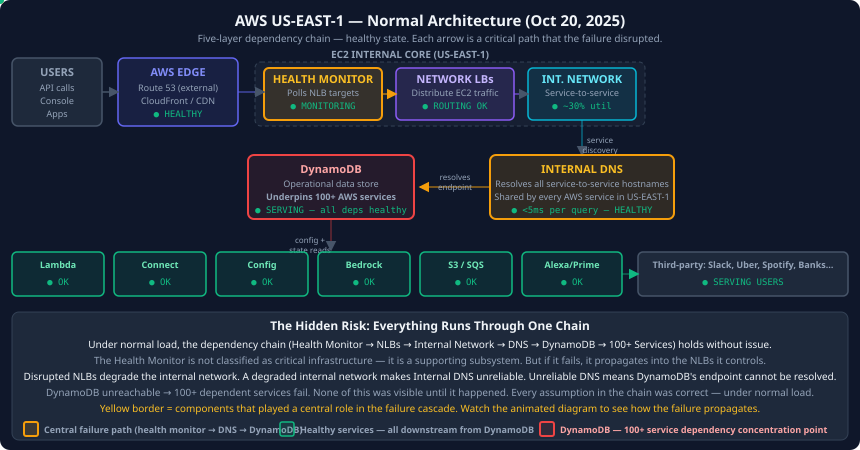
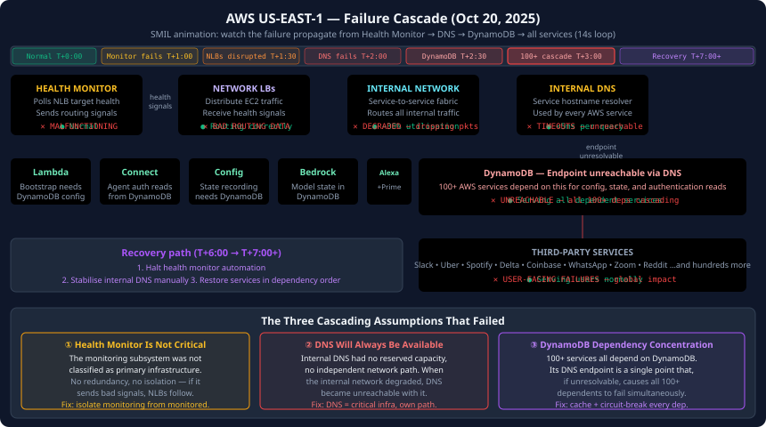

# AWS US-EAST-1 Cascade Failure — October 20, 2025

*How a malfunctioning health monitor inside EC2 triggered DNS failures that brought down DynamoDB, cascaded through 100+ AWS services, and knocked a significant fraction of the internet offline for most of a day.*

---

## What Users Experienced

At approximately 12:11 AM PDT on October 20, 2025, Amazon began investigating reports of increased error rates across US-EAST-1 — the Northern Virginia region that underpins more internet traffic than any other single data centre cluster on earth.

By morning, the scale of the failure was clear. Banking customers were locked out of their accounts. Travellers could not check in to flights online. Alexa devices stopped responding. Warehouse workers at Amazon's own fulfilment centres found their internal systems down. Across the internet, Slack, Zoom, Uber, Lyft, Spotify, Snapchat, Reddit, Discord, Coinbase, Robinhood, and dozens more showed degraded or completely broken service.

This was not a niche technical problem. It was the third major outage from the same US-EAST-1 cluster in five years. It disrupted more services and affected more users than either of the previous two. And it started not with a dramatic hack or a failed deployment, but with a monitoring subsystem that nobody had publicly thought of as critical infrastructure until it stopped working.

---

## Timeline

| Time (PDT) | Event |
|-----------|-------|
| 12:11 AM | AWS reports investigating increased error rates in US-EAST-1 |
| ~1:00 AM | Internal health monitoring subsystem for EC2 network load balancers begins malfunctioning |
| ~1:30 AM | EC2 internal network traffic management degrades as load balancer health signals become unreliable |
| ~2:00 AM | DNS resolution failures begin — internal services can no longer reliably resolve each other's endpoints |
| ~2:30 AM | DynamoDB's internal DNS endpoint fails to resolve consistently |
| ~3:00 AM | Cascade through DynamoDB's 100+ dependent services begins: Lambda, Connect, Config, Bedrock |
| ~4:00 AM | User-facing services (Alexa, Prime Video, Amazon.com) report widespread errors |
| ~5:00 AM | Third-party services built on affected AWS infrastructure begin mass failures |
| ~6:00 AM | AWS identifies root cause: health monitoring subsystem |
| ~8:00 AM | Mitigation of DNS issue begins |
| Late evening | Core services substantially restored; queued requests processing |
| Days after | Several services continue experiencing delays |

---

## The Subsystem Nobody Talked About

To understand this failure, you need to understand what a network load balancer health monitor actually does — and why it matters far more than its name suggests.

AWS Network Load Balancers (NLBs) sit at the front of EC2's internal traffic routing. They receive incoming requests and distribute them across a fleet of backend servers. For this to work correctly, the NLB must know which backend servers are healthy and available to receive traffic. It learns this through continuous health checks — a monitoring subsystem that polls each backend target at regular intervals and marks it as healthy or unhealthy.

When the health monitoring subsystem works correctly, it is invisible. The load balancers route traffic to healthy servers, unhealthy servers get pulled out of rotation, and everything flows. When it malfunctions, the consequences depend entirely on what the NLBs do when they receive incorrect health signals.

In this case, the malfunction caused EC2's internal network traffic management to degrade. The NLBs began making incorrect routing decisions based on bad health data. Traffic intended for healthy servers was misrouted. Traffic management tables became inconsistent. The EC2 internal network — which every AWS service in US-EAST-1 depends on for internal communication — began behaving unreliably.

---

## How the Failure Cascaded

The path from a misbehaving health monitor to a global internet disruption has four distinct stages. Each stage was a consequence of an architectural assumption that held until it didn't.

### Stage 1: Internal Network Degradation

As the health monitoring subsystem sent incorrect signals, EC2's NLBs began routing traffic based on faulty data. Some backend servers received more traffic than they could handle while others sat idle. Some requests were routed to servers that had actually failed. Retries and timeouts began accumulating. The EC2 internal network — not the external-facing network, but the fabric connecting AWS services to each other inside US-EAST-1 — started experiencing elevated error rates and latency.

This is a subtle but important distinction. The external network (connecting AWS to the internet) was initially unaffected. The problem was entirely inside the region, in the private network that AWS services use to talk to each other.

### Stage 2: DNS Resolution Failures

AWS's internal DNS infrastructure resolves service-to-service queries inside US-EAST-1. When Service A needs to talk to Service B, it sends a DNS query to resolve Service B's internal hostname. Under normal conditions, this takes a few milliseconds.

As the EC2 internal network degraded, DNS query responses became unreliable. Some queries timed out. Some returned incorrect or stale results. Services that needed to communicate with other services began seeing connection failures — not because the destination service was down, but because the DNS resolution step that provides the destination IP address was failing.

### Stage 3: The DynamoDB Endpoint Failure

DynamoDB is AWS's managed NoSQL database. It is used by an enormous fraction of AWS's own services for storing operational data — configuration, state, session information, metadata. AWS's internal documentation describes DynamoDB as underpinning more than 100 other AWS services.

DynamoDB's internal API endpoint is accessed through DNS. When internal DNS became unreliable, DynamoDB's endpoint could not be consistently resolved. Services that tried to read configuration from DynamoDB, update their state, or perform authentication checks began timing out. The first failure to reach DynamoDB from any service triggered a retry cascade. The retry traffic added further load to the already-degraded DNS infrastructure.

### Stage 4: The 100+ Service Cascade

With DynamoDB inaccessible, the cascade became almost inevitable. Lambda could not access its configuration store. Amazon Connect could not authenticate agents. AWS Config could not record resource changes. Amazon Bedrock could not retrieve model deployment state. Each of these services, unable to read from DynamoDB, either began failing their own health checks or started returning errors to their callers.

Those callers — application code, other AWS services, and ultimately end-user-facing services — began failing in turn. Alexa could not process voice commands. Prime Video could not verify entitlements. Amazon's e-commerce systems could not process orders. The failure had propagated from a single monitoring subsystem through three intermediate layers to become a global service disruption.

---

## The DynamoDB Dependency Problem

The scale of this cascade reveals a structural issue that goes beyond this specific incident. When more than 100 AWS services all depend on a single internal resource — DynamoDB — the resolution of that resource's endpoint becomes critical infrastructure for the entire region.

This is not a DynamoDB problem. DynamoDB itself was running correctly. The problem was that its internal DNS endpoint became unreliable, and no service had a fallback mechanism for the case where DynamoDB could not be reached.

This is the **dependency concentration problem**: when a large number of services all depend on a single shared resource, the failure of that resource's access layer becomes a region-wide event. The question every architect should ask is: "What happens to our system if DynamoDB (or our equivalent of DynamoDB) becomes unreachable for 30 minutes?"

For most AWS services on October 20, 2025, the answer was: complete failure.

The solutions to dependency concentration are architecturally difficult but not unknown:

**Local caching of critical configuration:** Services that read configuration from DynamoDB on every request could cache that configuration locally, serving from cache when DynamoDB is unreachable. The cost is stale configuration during the cache validity period. For most configuration values, staleness of minutes or hours is acceptable.

**Circuit breakers on shared dependencies:** When DynamoDB requests begin failing above a threshold rate, a circuit breaker opens and the service uses a degraded-but-functional mode rather than failing completely. The service degrades gracefully instead of crashing.

**Alternative endpoints and fallback paths:** DynamoDB endpoints in multiple regions. If the US-EAST-1 endpoint is unreachable, fall back to the US-WEST-2 endpoint. This adds latency but preserves functionality.

None of these require architectural redesign of DynamoDB itself. They require each dependent service to treat DynamoDB as a dependency that can fail, not as ambient infrastructure that will always be available.

---

## The Virginia Concentration Problem

US-EAST-1 is the oldest AWS region. It was the first AWS region, launched in 2006. Over nearly two decades, it has accumulated an outsized fraction of AWS's global infrastructure — not because of any planned concentration strategy, but because services built when it was the only option, and dependencies accumulated over time.

The consequence is that US-EAST-1 has a blast radius that is qualitatively different from any other AWS region. A failure in US-WEST-2 or EU-WEST-1 affects customers who run workloads in those regions. A failure in US-EAST-1 affects those customers, plus the control planes of many AWS services that are US-EAST-1-resident for historical reasons, plus the DNS and authentication infrastructure that other regions depend on US-EAST-1 to provide.

This is the **region dependency asymmetry problem**. From a resilience engineering perspective, the risk profile of US-EAST-1 is not the same as any other region, because its failure has second-order effects that other regions' failures do not. Building a multi-region architecture and placing your secondary region in US-EAST-1 provides less resilience than most architects assume, because US-EAST-1 failures are more likely to have global secondary effects.

Practically: if your disaster recovery strategy depends on failing over to US-EAST-1 from another region during a major incident, and that major incident is a US-EAST-1 failure (which the largest incidents historically have been), your disaster recovery plan has a dependency on the thing it is supposed to recover from.

---

## What a Next-Gen Network Engineer Takes From This

### The health monitor is also critical infrastructure

The team that designed EC2's NLB health monitoring system was not thinking about it as critical infrastructure. It was a monitoring component — a supporting system, not a primary one. That mental categorisation created a gap: primary services receive redundancy, isolation, and blast-radius analysis. Supporting systems frequently do not.

The lesson: **any system that, if it fails, causes primary systems to fail, is itself a primary system**. This includes monitoring infrastructure, health checkers, configuration systems, and control planes. The classification of "supporting" versus "primary" should be determined by the failure impact, not by the function's perceived importance.

### DNS resolution is a synchronous dependency at startup

Many services are designed to be resilient to the eventual failure of their dependencies — they use retries, circuit breakers, and caches. But most of those resilience mechanisms only work for services that are already running. The DNS dependency is different because it appears at the bootstrap stage: a service needs to resolve an endpoint before it can make its first request.

If DNS is unreliable during the startup window, a service cannot bootstrap. Services that cannot bootstrap cannot serve traffic. Services that cannot serve traffic cause their callers to fail. The bootstrap dependency is often the least-resilient part of a service's architecture because it was designed for the happy path — where DNS works — and never for the case where it doesn't.

The practical implication: services should cache resolved endpoints from previous successful startups. On startup failure due to DNS resolution errors, they should serve from cache rather than refusing to start. The cached endpoint may be slightly stale, but a stale endpoint is far better than no endpoint.

### Graceful degradation requires explicit design

None of the services that failed during this outage were designed to fail. They were designed to work correctly when their dependencies were available. The failure happened because "dependency unavailable" was not a designed operating mode — it was an unhandled exception.

Graceful degradation is the design practice of explicitly specifying what the system does when each of its dependencies fails. Not "the system fails," but "the system does X with reduced functionality." This requires enumerating dependencies, classifying them by criticality, and writing the degraded-mode behaviour explicitly into the code. It is harder than writing the happy path. It is the only way to avoid cascades.

### Blast radius is a property to design for, not a metric to measure after

The blast radius of the October 2025 outage — essentially the entire internet's dependency on US-EAST-1 — was not designed. It accumulated over 19 years of incremental decisions. No single team chose to make US-EAST-1 a global single point of failure.

This is the most important lesson for system design at hyperscale: blast radius grows by default. It takes active, continuous effort to keep it bounded. Every new dependency on US-EAST-1 services, every control plane that defaults to US-EAST-1, every DynamoDB table that stores state for a cross-region service, slightly increases the blast radius of a US-EAST-1 failure. Unless someone is explicitly measuring and bounding this, the blast radius will continue to grow until the next outage.

---

## How to Architect the System That Avoids This Class of Failure

The outage exposes five concrete architectural principles, each of which directly addresses one step in the cascade.

**1. Isolate health monitoring from the systems it monitors.**
The health monitoring subsystem for NLBs should run on separate physical infrastructure from the NLBs it monitors, with separate network paths, separate power, and separate failure domains. A health monitor that depends on the health of the system it monitors cannot give correct signals when that system fails.

**2. Treat internal DNS as first-class critical infrastructure.**
Internal DNS resolvers should have reserved network capacity that cannot be consumed by other traffic classes. They should have multiple independent network paths. Resolution should be achievable even during significant internal network degradation. The acceptable latency for internal DNS resolution should be a hard SLO with automatic alerting at violation.

**3. Cache and circuit-break every shared dependency.**
Every service that depends on DynamoDB, or any equivalent shared data store, should implement local caching with a sensible TTL and a circuit breaker that opens when the dependency's error rate exceeds threshold. Degraded mode — serving from stale cache — is a better outcome than complete failure in all cases except where the stale data would cause active harm.

**4. Test bootstrap failure explicitly.**
The scenario "DNS is unreliable during service startup" should be a required test case for every service. If a service cannot start when DNS responses are slow or intermittent, that is a defect to be fixed before the service ships, not a scenario to be discovered during an outage.

**5. Reduce US-EAST-1 control plane concentration.**
Any AWS service whose control plane is exclusively in US-EAST-1 has a hidden dependency on US-EAST-1's health that its SLA does not reflect. Distributing control planes across at least two geographically separate regions — with active-active or active-warm failover — reduces the blast radius of any single region's failure.

---

## The Broader Pattern

The October 2025 outage is not primarily a story about AWS or about DynamoDB or about health monitoring subsystems. It is a story about how large systems accumulate hidden dependencies over time, and how those hidden dependencies create failure modes that appear catastrophic and surprising but are, in retrospect, structurally inevitable.

Every large system has its equivalent of US-EAST-1 concentration. Every large system has its equivalent of the DynamoDB dependency bomb — one shared resource that too many other things depend on. Every large system has its monitoring components that were never classified as primary infrastructure because their function is supporting rather than operational.

The next-generation network engineer's job is not to prevent outages by preventing mistakes. Mistakes will always happen. The job is to design systems where any single mistake — any single component failure, any single monitoring malfunction, any single DNS resolution error — cannot cascade into a region-wide event. The blast radius is the design target. Everything else follows from it.
