## Building a Network for YouTube Scale — From First Principles

When someone asks how you would build YouTube's network, the temptation is to jump straight to load balancers and CDNs. That instinct is wrong. The right starting point is not the tools — it is the scale. At YouTube's scale, the numbers themselves make most of the decisions for you.

Start with one figure: YouTube serves more than one billion hours of video every day. Not views. Hours.

That single number rewrites every assumption you might have about what a network needs to do.

---

### Step One: Translate Usage Into Infrastructure

Before designing anything, you need to understand what a billion hours of daily viewing means in terms of bandwidth, storage, and compute. This is the step most people skip, and it is the most important one.

**Bandwidth:**

If you assume an average bitrate of 2 Mbps per stream — a reasonable blend of mobile 360p and desktop 1080p — and a peak concurrency of around 50 million simultaneous viewers, the math is immediate:

50,000,000 × 2 Mbps = **100 Tbps of outbound bandwidth**

No single data center can push 100 Tbps to users around the world. This is not a technical problem you solve by buying bigger switches. It is the reason you need a CDN, and it is the first constraint that shapes every decision downstream.

**Storage:**

YouTube receives approximately 500 hours of new video every minute. Each upload is transcoded into multiple resolutions — 360p, 480p, 720p, 1080p, 4K, and HDR variants — before it can be served. A single hour of video, stored in all variants, occupies roughly 20–30 GB. Across years of uploads, YouTube's stored video library is estimated in the hundreds of exabytes.

**Compute:**

Every video upload triggers a transcoding pipeline before it can appear to viewers. Transcoding is CPU and GPU intensive. A one-hour video may require dozens of parallel transcoding workers to produce all resolution variants within minutes of upload. At 500 hours per minute arriving continuously, you are running a transcoding pipeline that never stops.

These three numbers — 100 Tbps, hundreds of exabytes, continuous parallel transcoding — define the architecture you need to build.

---

### The Origin Data Center

The origin data center is where the master copies live. It handles uploads, runs the transcoding pipeline, stores everything, and answers requests that the CDN cannot serve from cache.

The internal network of the origin DC is a Clos fabric, for the same reasons we have already discussed: non-blocking bandwidth between any two points, horizontal scalability, and no single failure that takes down the fabric. But the server population inside that fabric is different from a general-purpose cloud.

**Ingestion layer:** Servers that accept video uploads from creators around the world. Bandwidth-heavy on inbound. They validate uploads, strip metadata, and immediately hand off to the transcoding queue.

**Transcoding workers:** CPU and GPU intensive servers that pull raw video from storage, process it, and write multiple output files back to storage. A single video generates dozens of simultaneous storage reads and writes — all east-west traffic across the fabric.

**Distributed storage:** Most of the rack count in the origin DC is storage. These servers hold petabytes of video data. They are read and written by transcoding workers, by the ingest layer, and by the cache servers.

**Origin cache:** A warm tier of recently uploaded and highly requested videos, sitting at the edge of the DC network. When the CDN has a cache miss, it first checks origin cache before pulling from distributed storage.

Because the transcoding pipeline creates massive east-west traffic — workers reading from distributed storage, writing back, coordinating with orchestration services — the aggregation layer of the DC fabric needs to be low-oversubscription or non-blocking. Congestion in the transcoding pipeline slows down video availability for viewers.

---

### Getting Traffic Out of the Data Center

Serving traffic directly from the origin to users around the world is not viable. A viewer in Mumbai requesting a video stored in Iowa would see buffering as the packets traverse thousands of kilometres of internet. Even with the fastest hardware, the speed of light is a hard limit.

You need to push content closer to users. But before CDNs can help, you need a way to get that content out of the origin DC and onto the internet efficiently.

YouTube (as part of Google) connects to the internet through three mechanisms:

**Internet Exchange Points (IXPs):** Physical facilities where networks meet to exchange traffic directly. Google connects at every major IXP — DE-CIX in Frankfurt, AMS-IX in Amsterdam, LINX in London, Equinix in the US. At an IXP, Google's routers peer directly with hundreds of ISPs simultaneously, exchanging routes and traffic without any middleman. This eliminates transit fees and removes one or more hops from the path to users.

**Direct peering:** Google has bilateral peering agreements with major ISPs and telecom operators. Traffic from a Comcast subscriber watching YouTube travels directly from Google's network to Comcast's network — no transit provider involved. Google operates Google Global Cache (GGC), which places Google-owned servers directly inside ISP networks, sometimes as close as the ISP's own content delivery layer.

**Transit:** For locations where direct peering isn't possible, Google purchases transit from tier-1 carriers. Transit is the fallback — it always works, but it costs more per bit and adds AS hops.

The goal of this peering strategy is to minimize the number of autonomous systems between Google and the user. Every extra AS hop is a potential point of congestion, a potential source of latency, and a bill to pay.

---

### The CDN: Three Tiers, One Goal

The CDN's job is to make the origin irrelevant for most requests. A well-designed CDN achieves 95% or higher cache hit rates at the edge, meaning 95 out of 100 video requests never touch the origin servers at all.

This works because video is an extraordinarily cacheable workload. Unlike a search result or a social media feed — which are personalized per user and cannot be cached — a YouTube video is identical bytes for every viewer. One copy at an edge node can serve thousands of simultaneous viewers.

The CDN is organized into three tiers:

**Edge PoPs:** Small to medium nodes deployed close to users, often inside or directly adjacent to ISP networks. An edge PoP might serve a single metro area or a small country. It caches the most popular content — the top few percent of videos that account for the vast majority of views. Most user requests are served here, a few milliseconds from the viewer.

**Regional caches (mid-tier):** Larger nodes positioned between edge PoPs and the origin. When an edge PoP misses its cache, it asks a regional cache before going all the way to origin. Regional caches store a larger and less popular slice of the catalog. They dramatically reduce origin load and improve overall hit rates.

**Origin:** The master. Only contacted when both edge and regional caches have missed. At a 95% edge hit rate and 80% regional hit rate on misses, the origin handles roughly 1% of total requests.

When a video starts trending, the CDN propagates copies outward through the hierarchy. By the time a video has gone viral, every major edge PoP has already cached it from regional traffic, and regional caches filled from origin hours earlier.

---

### Anycast: Routing Users to the Nearest PoP

YouTube announces the same IP prefix from multiple PoP locations simultaneously using BGP anycast. From the internet's perspective, that IP address is reachable via many different paths. BGP's shortest-path selection does the work: a user in Tokyo gets routed to the Tokyo PoP because that advertisement is AS-path shortest. A user in Amsterdam gets the Amsterdam PoP.

No application logic is required for this. The routing protocol handles it at the network layer, automatically and in real time. If a PoP fails, its BGP advertisement withdraws, and traffic seamlessly re-routes to the next-closest location.

DNS complements anycast. YouTube's authoritative DNS servers use GeoDNS to return different IP addresses based on the location of the recursive resolver making the query. A resolver in Brazil gets a different answer than a resolver in South Korea. This steers users toward the correct regional pool of PoPs before BGP anycast handles the final-hop selection.

Together, these two mechanisms ensure that a viewer in São Paulo hits a Brazil PoP, a viewer in Tokyo hits a Japan PoP, and a viewer in Nairobi hits an East Africa PoP — all without any application-level redirects, and all transparent to the end user.

---

### Caching: The Full Stack

Caching is not only what the CDN does. It is a principle that operates at every layer of the stack, and understanding each layer is important for reasoning about latency and bandwidth.

**Browser cache:** Static assets — thumbnails, JavaScript, CSS, icons — are returned with aggressive `Cache-Control` headers. They are cached by the browser and not re-fetched on subsequent visits. Video segments themselves are not typically cached in the browser; they are streamed progressively. But the manifest file (the playlist that tells the video player which segments to fetch, in what order, at what bitrate) is often cached briefly.

**ISP transparent proxy:** Some ISPs deploy transparent caches inside their own network. These are outside Google's control, but they reduce the ISP's transit costs and improve latency for popular content. Google's GGC deployments — physical Google caches inside ISP racks — serve a similar purpose but are under Google's control.

**CDN edge cache:** The primary cache. Popular videos are cached here for hours or days, refreshed according to TTL and eviction policies. The eviction algorithm is typically LRU-weighted, sometimes augmented by predicted future popularity from view-count signals.

**CDN regional cache:** Less popular but still worth caching regionally. Larger storage footprint. Longer TTLs. Serves edge misses before origin is contacted.

**Origin hot cache:** A warm layer at the origin for content that is freshly uploaded (before it propagates to CDN) or experiencing sudden unexpected demand. This prevents a single viral video from hammering distributed storage directly.

Each cache layer reduces load on the layer behind it. The goal is that most requests terminate at the edge, and the origin only ever sees a trickle.

---

### Bandwidth Engineering: Planning the Capacity

With a system of this kind, every tier's required capacity follows from the cache hit rates and the total egress number.

At 100 Tbps total:

| Tier | Cache hit rate | Bandwidth served |
|------|---------------|-----------------|
| CDN edge PoPs | ~95% | ~95 Tbps |
| CDN regional | ~80% of misses | ~4 Tbps |
| Origin | remainder | ~1 Tbps |

These numbers drive every capacity decision:

**Edge PoP storage:** More storage per edge means a higher local hit ratio. A 200 TB cache at an edge PoP holds far more popular content than a 20 TB cache and dramatically reduces regional and origin traffic.

**Edge PoP count:** More PoPs means lower bandwidth per PoP and lower latency for users in more locations. But each PoP has operational overhead. The tradeoff is between latency, bandwidth cost, and complexity.

**Peering capacity:** At each IXP, the ports connecting to peers must be sized for peak traffic to that region, with headroom. Running links at 90%+ utilization means any traffic spike causes congestion.

**DC egress:** Even though the origin serves only ~1% of requests, at 100 Tbps total, that is still 1 Tbps of origin egress. The border routers, IXP ports, and DC uplinks must all be sized for this.

**Transcoding pipeline throughput:** Internally, the east-west bandwidth required by transcoding is largely decoupled from viewer egress. It is driven by upload volume and transcoding speed requirements. With 500 hours per minute arriving, and each hour requiring perhaps 10–15 parallel transcoding jobs, the fabric must support tens of thousands of concurrent read/write streams between workers and storage.

The architecture that results from following this logic is the same pattern used by every large-scale video platform: a Clos-fabric origin DC, a three-tier CDN, BGP anycast steering, and caching at every layer. The details differ; the structure does not. The scale makes it the only sensible answer.
